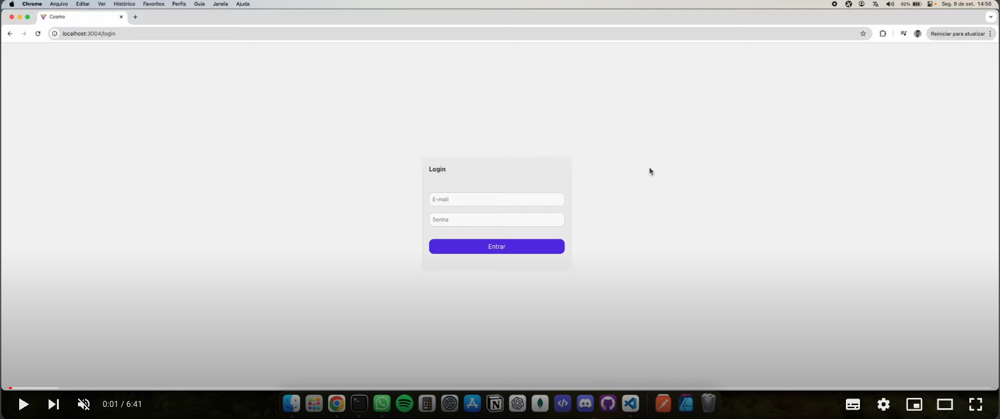

<h1 align="center">
Agendamento
  <br>
</h1>

<h4 align="center">Uma aplicação para organizar os agendamentos de qualquer item construido em,
<a href="https://pt-br.react.dev/blog/2023/03/16/introducing-react-dev" target="_blank">React JS</a>
 e <a target="_blank" href="https://nodejs.org/pt">Node JS</a>.</h4>

 <p>Clique na imagem, para visualizar o video no YouTube</p>

[](https://youtu.be/zIexZUayF6I 'Assistir ao video')

## Sobre o projeto

Essa aplicação foi desenvolvida com o propósito de fornecer uma solução completa de gerenciamento para estabelecimentos que necessitam agendar itens e gerenciar seus horários de funcionamento. Ela oferece uma interface amigável para que usuários possam realizar o CRUD (Create, Read, Update, Delete) dos itens disponíveis para agendamento, além de permitir o controle dos horários de operação da empresa.

A API foi construída utilizando Node.js e TypeScript, oferecendo robustez e segurança para o backend. O frontend foi desenvolvido com React.js e TypeScript, utilizando o Vite como ferramenta de build, o que proporciona um ambiente de desenvolvimento rápido e eficiente.

## Recursos Principais

- Gerenciamento de Empresa: A aplicação permite o cadastro e edição de informações da empresa, como nome, descrição e outros detalhes relevantes para o estabelecimento.

- Horários de Funcionamento: Através do CRUD, é possível definir os horários de abertura e fechamento da empresa para cada dia da semana. Esses horários são essenciais para determinar a disponibilidade dos itens e agendamentos.

- Gestão de Itens para Agendamento: A aplicação possibilita a criação, leitura, edição e exclusão de itens que podem ser agendados. Cada item representa um serviço ou produto que a empresa oferece para agendamento.

- Agendamentos de Itens:
  • O sistema permite que os usuários façam agendamentos para os itens cadastrados, respeitando os horários de funcionamento da empresa.
  • A aplicação impede sobreposições de horários, garantindo que um mesmo item não possa ser agendado em dois horários conflitantes. 5. Painel de Agendamentos Dinâmico: O painel de agendamentos é gerado automaticamente com base nos horários de funcionamento da empresa. A primeira hora disponível para agendamento corresponde à hora de abertura do estabelecimento, e o último horário disponível corresponde ao horário de fechamento.

Esses recursos combinados tornam a aplicação ideal para empresas que precisam gerenciar seus serviços e horários de forma eficiente, permitindo um controle preciso sobre os itens oferecidos e garantindo a organização dos agendamentos.

## Deploy

Realizei o deploy em um servidor da DigitalOcean.

> Clique no IP para ver o Front-End
> Login: teste@gmail.com
> Senha: 123456789

> (<a href="http://[159.89.239.199:3004](http://159.89.239.199:3004)">http://159.89.239.199:3004 </a>)

## Como usar

Para clonar e executar este aplicativo, você precisará do [Git](https://git-scm.com) e do [Node.js](https://nodejs.org/en/download/) e [npm](http://npmjs.com) instalados em seu computador.

Na sua linha de comando:

```bash
# Clone o repositorio
$ git clone https://github.com/kaique-oliveira/app-agendamento.git

# Entre na pasta app-agendamento e API
$ cd pasta app-agendamento/api

# Instalar dependências
$ npm install

# crie um .env com uma string de conexação e secrete para o token, existe um exemplo no diretório api chamado example.env

# tenha o postgres instaldo e rode o comando do prisma para gerar as tabelas e rode o um arquivo para popular a tabela de dias da semana

$ npx prisma migrate dev
$ cd prisma node seed.js

# Execute o aplicativo
$ npm run dev

## front-end

# Entre na pasta Web
$ cd ../web

# Instalar dependências
$ npm install

# Execute o aplicativo
$ npm run dev
```

## Credits

Principais frameworks e bibliotecas utilizados:

- [React-JS](https://pt-br.react.dev/blog/2023/03/16/introducing-react-dev)
- [Node-JS](https://nodejs.org/pt)
- [Vite](https://vitejs-dev.translate.goog/?_x_tr_sl=en&_x_tr_tl=pt&_x_tr_hl=pt-BR&_x_tr_pto=sc)
- [Prisma](https://www.prisma.io/?via=Loc&gad_source=1&gclid=Cj0KCQjwiuC2BhDSARIsALOVfBI1VWnrSTT9rfBl-qOXUDYIxgvnYEzSeVE_LNgncy2mIT-FQb_5tocaAmiJEALw_wcB)
- [Postgres](https://www.postgresql.org/)

---

> GitHub [@kaique-oliveira](https://github.com/kaique-oliveira) &nbsp;&middot;&nbsp;
> Linkedin [@kaique-oliveira](https://www.linkedin.com/in/kaique-oliveira-a21273162/)
